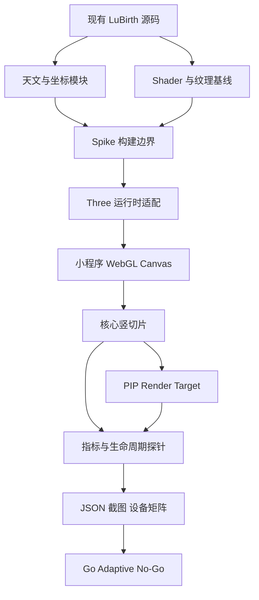
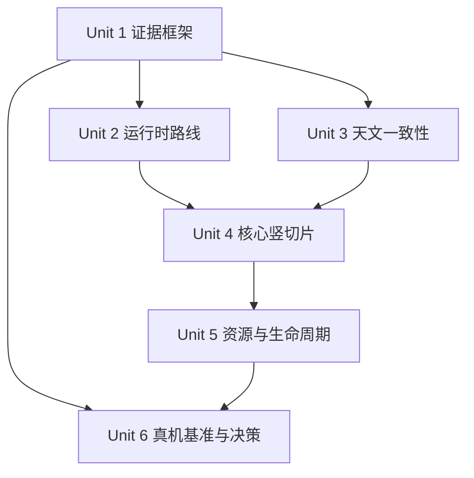
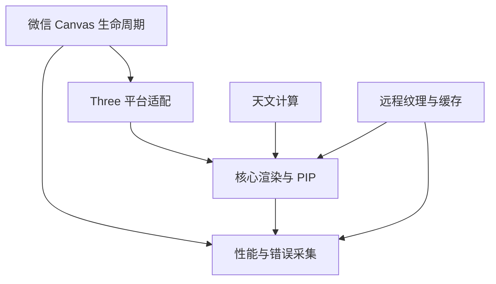

# feat: 微信小程序原生渲染能力 Spike

## Overview

在正式移植 LuBirth 前，用一个 5 个工作日、最多 7 个工作日封顶的技术 Spike，验证原生微信小程序是否能够以可维护方式承载 LuBirth 的核心天文计算与 Three.js 渲染能力。

本 Spike 不是“做一个能转的地球”，而是完成一条足以暴露真实风险的竖切片：固定太阳、地球昼夜、云层、大气、真实月相、月球 PIP、触摸相机、2K/8K 资源档位、页面生命周期和真机性能。最终输出 `GO-FULL`、`GO-ADAPTIVE` 或 `NO-GO-NATIVE`，作为是否进入正式移植及采用何种画质策略的依据。

**计划假设：**目标是原生微信小程序；`web-view` 只作为决策后的兜底，不是本 Spike 的实现路线。若产品对最低机型、最低基础库或必须保持 8K 画质已有硬性要求，应在执行前补充到本计划，不能在 Spike 中静默降低设计目标。

## Problem Frame

LuBirth 当前运行在浏览器环境，技术栈为 React 18、React Three Fiber、Drei、Three.js r160、Vite 和 `astronomy-engine`。小程序提供 WebGL Canvas，但现有项目依赖的浏览器宿主能力并不能直接搬移：

- `@react-three/fiber`、`@react-three/drei`、React DOM 和 `OrbitControls` 依赖浏览器 Canvas/DOM/事件宿主；
- `src/SimpleTest.tsx` 同时承担 UI、状态、浏览器事件和 R3F 场景编排，不能作为原生小程序页面直接复用；
- 地球、云层、大气和月球包含自定义 Shader，使用导数扩展、法线/位移贴图和多纹理采样；
- 纹理加载、音频、截图、URL 参数、`window` 事件和 `localStorage` 均有浏览器 API 依赖；
- 当前 Three.js 是 r160，而微信官方 `threejs-miniprogram` 适配仓库仍以 r108 为基础，存在较大的 API、Shader 和色彩管理版本差；
- 现有文档描述了 PIP 目标，但当前代码中未发现 `enablePIP`、`MoonPIP` 或 `WebGLRenderTarget` 的实际实现，因此小程序 Spike 必须验证真实 PIP 渲染链路，不能把文档状态当成已完成能力。

核心问题不是“小程序有没有 WebGL”，而是：**核心画面能否在目标真机上稳定运行，适配层能否保持边界清晰，且后续正式移植无需维护一个无界的 Three.js 私有分叉。**

## Requirements Trace

- **R1 — 原生运行时：**在微信小程序原生 `canvas type="webgl"` 上创建并销毁 Three.js 渲染器，不以 `web-view` 作为通过条件。
- **R2 — 运行时路线决策：**优先验证 Three.js r160 的窄适配层；失败时在限定时间内验证官方 r108 适配器，记录 API 差异和长期维护成本。
- **R3 — 天文计算一致性：**复用现有 `astronomy-engine` 与 LuBirth 天文模块的单一源码，现有太阳/月相测试样例在小程序中通过，不手工复制另一套算法。
- **R4 — 核心视觉竖切片：**验证固定太阳、旋转地球、昼夜纹理、云层、大气、月球 Shader、出生点/相机对齐、星空背景和触摸控制。
- **R5 — PIP：**使用同一 WebGL 上下文中的离屏 render target 渲染真实月球并合成到屏幕；验证 256/512 分辨率与 30fps 降帧策略。`wx.createOffscreenCanvas` 仅作为兼容性备选实验，不代替核心 PIP 验证。
- **R6 — 资源档位：**分别验证当前 2K 基线资源和 8K 高画质资源，不将 8K 失败静默解释为移植成功。
- **R7 — 真机性能：**输出可重复的帧率、帧时间、首个稳定画面、PIP 增量、Shader/纹理错误和生命周期稳定性数据。
- **R8 — 生命周期与恢复：**页面进入、隐藏、显示、卸载及内存告警时，动画、监听器、纹理、材质、几何体和 render target 能正确暂停、恢复和释放。
- **R9 — 决策产物：**形成运行时选择、设备矩阵、失败证据、画质结论、正式迁移边界和估算，不以主观观感代替 Go/No-Go 门槛。

## Scope Boundaries

### In Scope

- 独立的小程序 Spike 工程与构建边界；
- 代表生产复杂度的 LuBirth 竖切片，而非简化材质演示；
- Three.js r160 与官方 r108 适配路线的有界验证；
- 天文计算、Shader、纹理、PIP、触摸、生命周期和性能证据；
- iOS/Android 真机验证以及最终决策报告。

### Out of Scope

- 完整移植 `src/SimpleTest.tsx`、控制面板或全部构图参数；
- 登录、支付、分享、订阅消息、城市搜索等业务功能；
- 音乐播放器、截图保存、完整无障碍和正式 UI 设计；
- 正式重构 Web 端或抽取最终 monorepo/shared package；
- 为了让 Spike 通过而删减已确认的地球、云层、大气或 PIP 设计；
- 未经后续确认直接进入正式小程序开发。

## Success Metrics and Decision Gate

以下为 Spike 的初始工程门槛；若产品在执行前给出更高目标，以产品目标为准。

| 维度 | 通过门槛 | 证据 |
|---|---|---|
| 运行时 | 真机成功创建 WebGL/Three renderer；适配层职责可枚举，无全局 DOM 模拟层 | 能力矩阵、错误日志、适配文件清单 |
| 天文一致性 | 现有太阳与月相核心样例全部通过；太阳/月球方向与 Web 基线的角差不超过 0.01° | Web 与小程序 JSON 对比 |
| Shader | 地球、云层、大气、月球 Shader 零编译/链接错误；关键扩展和精度能力被记录 | GL capability 与 Shader 日志 |
| 核心画面 | 固定太阳、昼夜、云层透明、地球大气、真实月相、PIP、星空和出生点对齐均可观察且逻辑正确 | 固定时刻截图和检查表 |
| 基线性能 | 2K 全效果预设在中档目标真机预热后持续 60 秒，帧率中位数不低于 30fps，p95 帧间隔不高于 50ms | 每设备原始 JSON |
| PIP 性能 | 256px、30fps PIP 在同设备、同场景的三轮配对测试中，帧时间中位数增量不高于 2ms/frame；同时报告 p95 与 512px 数据 | PIP 开/关 A/B 原始数据 |
| 稳定性 | 连续运行 10 分钟、页面进入/退出 10 次无崩溃、黑屏、context loss 或未释放的 RAF/监听器 | 生命周期日志和真机记录 |
| 资源 | 2K 基线加载成功；8K 高画质单独完成压力测试并明确设备适用范围 | 资源矩阵、解码/上传耗时 |
| 可维护性 | 无需长期维护大面积 Three 核心修改；若必须 fork，变更范围、升级策略和责任清晰 | 差异报告与维护评估 |

### 决策分级

| 结论 | 条件 | 后续动作 |
|---|---|---|
| `GO-FULL` | 核心门槛全部通过，高画质档在目标设备矩阵中满足稳定性与性能要求，适配成本有界 | 进入正式原生移植规划 |
| `GO-ADAPTIVE` | 2K 全效果基线通过，但 8K、部分低端设备或适配维护成本未达到完整目标 | 先由产品确认分级画质/最低机型，再进入移植；不得自动降级 |
| `NO-GO-NATIVE` | 2K 核心竖切片仍无法稳定运行，关键 Shader/PIP 跨平台不可用，或适配需要无界 Three 核心分叉 | 停止原生移植，评估原生壳 + H5 或继续 Web 版 |
| `INCONCLUSIVE` | 缺少真实 AppID、合法资源域名或最低真机矩阵，导致关键证据无法采集 | 不得宣称 Go；补齐条件后继续 Spike |

所有 Go 结论只表示“值得进入正式移植架构与排期”，不表示小程序已经达到发布状态，也不授权直接改造生产代码。

## Context & Research

### Relevant Code and Patterns

- `package.json`：React 18、R3F 8.15、Drei 9.105、Three.js 0.160、`astronomy-engine` 2.1。
- `src/SimpleTest.tsx`：当前 R3F Canvas、场景编排、OrbitControls、URL/DOM/存储/截图和大量 UI 状态的集中入口。
- `src/scenes/simple/api/components/Earth.tsx`：地球自定义 Shader，包含昼夜、法线、位移、云影及导数扩展，是运行时能力验证的最高风险对象之一。
- `src/scenes/simple/api/components/Clouds.tsx`：云层自定义 Shader、多层与场景感知逻辑。
- `src/scenes/simple/api/components/AtmosphereEffects.tsx`：大气层与近地辉光 Shader。
- `src/scenes/simple/api/components/Moon.tsx`：真实月相、法线/位移和导数 Shader，应作为 PIP 的真实渲染对象。
- `src/scenes/simple/utils/textureLoader.ts`：现有分阶段 2K→8K 加载模式可作为策略参考，但 DOM Canvas 和 `window` 事件实现不能复用。
- `src/astro/ephemeris.ts`：基于 `astronomy-engine` 的太阳/月球计算及 Y-up/ECEF 映射。
- `src/astro/autoTests.ts`、`src/astro/fullLightingAutoTest.ts`、`src/astro/moonPhaseAutoTests.ts`：小程序一致性基线和 JSON 输出模式。
- `src/scenes/simple/utils/lightingUtils.ts`、`src/scenes/simple/utils/birthPointAlignment.ts`：固定太阳、季相和出生点对齐约束。
- `src/types/SimpleComposition.ts`：现有构图参数源；当前没有实现文档中描述的 PIP 配置字段。
- `public/textures/`：包含 2K 与 8K 纹理；8K 纹理解码后的 GPU/系统内存成本远高于文件体积，必须真机测量。
- `docs/TODO3.md`、`docs/固定太阳模式与相机极坐标方案暨后续规划.md`：定义固定太阳、单光源、相机独立和 PIP 性能目标，但部分 PIP 完成状态与当前代码不一致，以代码和 Spike 实测为准。

### Institutional Learnings

- 仓库没有 `docs/solutions/`，因此没有可复用的小程序集成先例。
- 项目现有自动测试偏向纯天文算法；渲染、资源、PIP 和生命周期缺少跨宿主测试，Spike 必须补齐这些证据面。
- 现有架构约束要求：单一方向光、固定太阳方向、相机与星空不挂地球组、Y-up 坐标、光照方向使用“从太阳射向地球”的方向。小程序竖切片不得改变这些不变量。

### External References

- 微信官方 Canvas 文档：支持 `canvas type="webgl"`；官方同时提示 WebGL 应使用真机预览验证，Android 过大 Canvas 可能崩溃。
- 微信官方 Canvas 文档：`webgl` 类型从基础库 2.7.0 起可用；最低基础库仍应由实际使用到的全部 API 和产品目标共同决定，不能只按 Canvas 的最低版本锁定。
- 微信官方 `wx.createOffscreenCanvas` 文档：新版接口从基础库 2.16.1 起可用，可创建 `webgl` 离屏 Canvas，但类型必须在创建时确定，不能与 2D 上下文混用。
- 微信官方运行时性能、资源和内存文档：大图片会增加解码、绘制和内存成本，可能导致掉帧、黑/白屏或闪退；页面卸载需解绑监听并释放引用。
- 微信官方 FPS/性能面板：用于采集帧率、启动、页面切换以及 Android CPU/内存数据；FPS 调试配置不得进入正式版本。
- 微信官方 `threejs-miniprogram`：提供 scoped Three.js 适配，但仓库当前以 Three.js r108 为基础，与 LuBirth r160 不同。

## Key Technical Decisions

| 决策 | 选择 | 理由与边界 |
|---|---|---|
| Spike 隔离 | 在 `spikes/wechat-miniprogram/` 建立独立工程，不改 Web 端行为 | 避免探索性依赖和适配污染正式代码；正式共享核心结构留到 Go 决策后设计 |
| 场景实现 | 使用命令式 Three.js 完成竖切片，不先移植 R3F | 先隔离并验证 Canvas/WebGL/Three 的真实能力；R3F 宿主复用属于后续架构选择，不在 Spike 中实现自定义 reconciler |
| 首选运行时 | 首先验证 r160 + 窄平台适配 | 最大程度保持现有 Shader、色彩空间与 API 语义，避免先接受 r108 回退成本 |
| 备选运行时 | r160 在 1.5 个工作日内无法形成稳定最小链路时，切换官方 r108 适配器做对照 | 保证 Spike 仍能回答“原生是否可行”，但 r108 通过不自动代表正式路线可维护 |
| 天文源码 | 通过 Spike 构建边界直接打包当前 `src/astro/` 源码，不复制算法 | 保持 Web 与小程序单一事实源，防止 Spike 因复制代码得出虚假一致性 |
| Shader 来源 | 尽可能从现有组件提取同源 Shader；任何为小程序做的改写必须逐项记录 | “具有相似效果的新 Shader”不能证明现有设计可移植，也会隐藏正式迁移成本 |
| PIP | 同一 renderer + `WebGLRenderTarget` + 屏幕合成是主验证路径 | 与 LuBirth 目标架构一致，能真实测量额外渲染成本；第二个 `wx.createOffscreenCanvas` 只作为失败诊断备选 |
| 画质 | 分别测试 2K 基线和 8K 高画质，不预先选择降级 | Spike 输出能力边界；是否接受自适应画质是用户后续决策 |
| 测试 | 自动采集 JSON + 固定时刻截图 + 真机人工检查 | 数值、性能与视觉都需要证据，单一维度不足以做 Go 决策 |

## Open Questions

### Resolved During Planning

- **是否直接移植 React/R3F？**不直接移植。Spike 先证明原生 Canvas/Three 渲染能力，并记录正式移植所需的 renderer/UI 分层边界。
- **是否把 WebView 当作 Spike 成功？**不。WebView 仅在 `NO-GO-NATIVE` 后作为替代方案讨论。
- **是否用简化球体替代真实月球/PIP？**不。必须使用代表当前 Moon Shader 和月相逻辑的实现，否则无法覆盖关键风险。
- **8K 失败是否仍算完全通过？**不。只能得出 `GO-ADAPTIVE`，且必须由用户确认画质策略。
- **是否在 Spike 中重构正式共享包？**不。仅建立可删除的构建边界；Go 后再设计正式共享核心。

### Deferred to Implementation

- **r160 适配需要哪些具体 Canvas/Event/Image 补丁？**必须通过最小 renderer 实验才能确定；记录每个补丁及其 Three 内部依赖。
- **目标基础库下的 WebGL 版本、扩展、精度和纹理上限是什么？**按每台真机运行时查询并写入能力矩阵。
- **`astronomy-engine` 的小程序 NPM 构建是否需要转译或 shimming？**由真实打包与运行结果确定，不允许通过复制计算结果绕过。
- **PIP 用 render target 还是独立 OffscreenCanvas 更稳定？**先验证 render target；仅在失败时用 OffscreenCanvas 定位上下文限制。
- **最终最低机型和高画质适用机型是什么？**Spike 提供设备数据，产品据此锁定，不在计划阶段臆测。

### Resolve Before Final Decision

- **最低支持机型、最低微信基础库和最低微信版本：**不阻塞前四天实验，但在最终报告前必须由产品确认；未确认时最高只能输出 `GO-ADAPTIVE`。
- **8K 是否属于不可降级的发布要求：**Spike 同时提供 2K/8K 证据；如果这一产品要求未确认，报告必须分别给出两种结论，不能替用户选择画质。
- **设备矩阵是否覆盖真实目标用户：**若只能拿到临时设备，最终结果必须列为证据限制，不能扩张到全部用户群。

## Dependencies / Prerequisites

- 一个可用于真机预览的小程序 AppID；若只有测试号，需确认 WebGL、NPM 和网络能力没有被测试号限制。
- 可配置的 HTTPS 资源域名，用于验证远程纹理；没有合法域名时，资源网络结论只能标记 `INCONCLUSIVE`。
- 最少三台真机：一台 iOS 主流设备、一台 Android 中档设备、一台 Android 低档设备；推荐再增加一台较旧 iOS 设备。
- 每次记录设备型号、系统版本、微信版本、基础库版本、屏幕 DPR、WebGL 版本和扩展。
- Web 基线必须使用同一固定时间、经纬度、构图参数和资源档位生成。
- 每次 Web/小程序对照记录源代码 revision、工作区是否 dirty、依赖锁文件摘要和资源清单摘要，避免不同源码状态的数据被误配。

## High-Level Technical Design

> *下图仅说明评审所需的目标边界和证据流，是方向性指导，不是实现规格。执行者应把它作为上下文，而不是照抄的代码结构。*

## Implementation Units

- [ ] **Unit 1: 建立隔离工程、基线与证据契约**

**Goal:** 建立可在微信开发者工具打开的独立 Spike 工程、统一的测试场景配置和 JSON 结果格式，确保后续每项实验可比较、可复跑。

**Requirements:** R1, R7, R9

**Dependencies:** None。真实 AppID、真机和资源域名可在脚手架之后补齐，但进入 Unit 2 真机结论和 Unit 6 最终决策前必须可用。

**Files:**

- Create: `spikes/wechat-miniprogram/package.json`
- Create: `spikes/wechat-miniprogram/build.config.mjs`
- Create: `spikes/wechat-miniprogram/project.config.json`
- Create: `spikes/wechat-miniprogram/src/app.ts`
- Create: `spikes/wechat-miniprogram/src/app.json`
- Create: `spikes/wechat-miniprogram/src/app.wxss`
- Create: `spikes/wechat-miniprogram/src/pages/capability/index.ts`
- Create: `spikes/wechat-miniprogram/src/pages/capability/index.json`
- Create: `spikes/wechat-miniprogram/src/pages/capability/index.wxml`
- Create: `spikes/wechat-miniprogram/src/pages/capability/index.wxss`
- Create: `spikes/wechat-miniprogram/src/config/scenarios.ts`
- Create: `spikes/wechat-miniprogram/src/metrics/result-schema.ts`
- Create: `spikes/wechat-miniprogram/src/metrics/performance-probe.ts`
- Create: `spikes/wechat-miniprogram/src/tests/harness-self-test.ts`
- Create: `spikes/wechat-miniprogram/.gitignore`
- Create: `spikes/wechat-miniprogram/README.md`

**Approach:**

- 将 Spike 的依赖、构建输出和私有配置与根项目隔离，不修改 Web 端构建或运行行为。
- 构建边界允许从仓库现有源码导入模块，并将小程序可执行代码与静态页面文件输出到独立 `miniprogram/` 目录；输出目录和真实 AppID 配置不作为源码提交。
- 定义固定实验场景：三个天文时刻、固定经纬度/构图、PIP 开关、2K/8K 资源档和 60 秒性能窗口。
- 统一记录运行时版本、设备信息、GL capability、测试状态、计时数据、错误与缺失前置条件。
- 统一记录源码 revision、dirty 状态、依赖与资源摘要；Web 基线与小程序结果只有指纹一致时才允许直接比较。
- 结果状态只允许 `pass`、`fail`、`unsupported`、`inconclusive`，禁止把未执行项计为通过。
- 每次测试先写不可变的 `results/runs/<run-id>.json`，汇总文件只引用原始 run id，避免重跑覆盖失败证据。

**Execution note:** 先建立证据契约再接入渲染，避免后期为已有结论补指标。

**Patterns to follow:**

- `src/astro/fullLightingAutoTest.ts` 的结构化 JSON 汇总方式；
- `src/utils/logger.ts` 的集中日志理念，但不复用浏览器全局事件。

**Test scenarios:**

- **Happy path:** 一个空能力测试写入设备元数据和 `pass` 状态，导出的 JSON 符合结果契约。
- **Edge case:** 缺少 AppID、设备字段或资源域名时，结果被标记为 `inconclusive`，而不是默认通过。
- **Error path:** 测试函数抛错时保留测试名、错误阶段和异常信息，后续测试仍能执行并输出汇总。
- **Integration:** 页面隐藏/显示后结果收集器继续使用同一 run id；页面卸载后停止计时器和 RAF。
- **Integration:** Web 基线与小程序结果的源码/依赖/资源指纹不一致时，对比被拒绝并标记 `inconclusive`。

**Verification:**

- 开发者工具可打开独立 Spike 页面；空测试能生成稳定、可解析且不包含私有 AppID 的 JSON。

- [ ] **Unit 2: 完成 Three.js 运行时适配路线对照**

**Goal:** 证明小程序 Canvas 能承载 Three renderer，并选择 r160 窄适配或 r108 官方适配中的可维护路线。

**Requirements:** R1, R2, R9

**Dependencies:** Unit 1；真实 AppID 是形成真机结论的前置条件，缺失时只能保留模拟器诊断并标记 `inconclusive`。

**Files:**

- Create: `spikes/wechat-miniprogram/src/runtime/runtime-contract.ts`
- Create: `spikes/wechat-miniprogram/src/runtime/r160-adapter.ts`
- Create: `spikes/wechat-miniprogram/src/runtime/r108-official-adapter.ts`
- Create: `spikes/wechat-miniprogram/src/runtime/capability-probe.ts`
- Create: `spikes/wechat-miniprogram/src/tests/runtime-capability-test.ts`
- Create: `spikes/wechat-miniprogram/results/runtime-comparison.json`

**Approach:**

- r160 路线先完成 Canvas、RAF、Image、事件和像素比的最小适配，不实现通用 DOM polyfill。
- 用同一组案例验证基础几何、纹理球、自定义 Shader、透明混合、render target 和资源销毁。
- 能力探针至少记录 WebGL 版本、GLSL 版本、highp 精度、`MAX_TEXTURE_SIZE`、`MAX_RENDERBUFFER_SIZE`、`MAX_VIEWPORT_DIMS`、纹理单元数、导数/深度纹理相关扩展和 context loss 行为。
- 若 r160 在 1.5 个工作日内仍不能形成稳定最小链路，冻结失败证据并启用官方 r108 对照；不得在未记录失败原因时无限调补丁。
- 比较的不只是“是否显示”，还包括适配行数/触及 Three 内部模块、Shader/API 差异、升级风险和平台差异。
- 只有平台边界补丁属于“有界适配”；若必须持续修改 renderer、material、shader chunk 或色彩管理核心，报告按长期私有 fork 风险处理。

**Patterns to follow:**

- `src/SimpleTest.tsx` 的 renderer 参数和色彩空间设置作为 Web 基线；
- `src/scenes/simple/api/components/Earth.tsx` 的导数扩展需求作为能力探针，而非只用最简单 Shader。

**Test scenarios:**

- **Happy path:** r160 adapter 在真机创建 renderer，渲染纹理球和导数 Shader，并能销毁后重新创建。
- **Edge case:** DPR、Canvas CSS 尺寸和 drawing buffer 尺寸不同，渲染仍保持正确宽高比且不创建过大缓冲区。
- **Error path:** 缺少扩展、Shader 编译失败或纹理格式不支持时，能力探针输出明确的 `unsupported/fail` 和原始 GL 日志。
- **Integration:** 页面 `hide/show/unload` 与 renderer 生命周期联动，不存在卸载后继续提交帧的 RAF。
- **Fallback:** r160 超时失败后，r108 用相同案例执行；报告必须指出哪些通过来自版本回退，不能混合两条路线的数据。

**Verification:**

- `results/runtime-comparison.json` 能给出明确推荐路线、适配边界和失败证据；若两条路线都不可维护，Unit 2 可直接触发 `NO-GO-NATIVE`。

- [ ] **Unit 3: 验证 astronomy-engine 与 LuBirth 天文核心一致性**

**Goal:** 用现有源码而非复制实现，在小程序运行太阳、月球、坐标转换和月相测试，并与 Web 基线比较。

**Requirements:** R3, R9

**Dependencies:** Unit 1；可与 Unit 2 并行。

**Files:**

- Create: `spikes/wechat-miniprogram/src/astro/entry.ts`
- Create: `spikes/wechat-miniprogram/src/astro/web-baseline.json`
- Create: `spikes/wechat-miniprogram/src/tests/astro-parity-test.ts`
- Create: `spikes/wechat-miniprogram/results/astro-parity.json`
- Reference without behavior change: `src/astro/ephemeris.ts`
- Reference without behavior change: `src/astro/autoTests.ts`
- Reference without behavior change: `src/astro/fullLightingAutoTest.ts`
- Reference without behavior change: `src/astro/moonPhaseAutoTests.ts`

**Approach:**

- Spike 构建入口直接导入现有 `src/astro/` 与 `astronomy-engine`，打包到小程序输出；禁止粘贴一份算法副本。
- 固定 Web 基线的时间、经纬度和预期数值，在小程序中执行同样输入。
- 同时验证 `Date`、时区转换、极区、日期变更线和天顶附近方位角边界。

**Execution note:** 使用已有测试样例做 characterization；若小程序打包失败，先定位模块/运行时问题，不改天文公式来迁就平台。

**Patterns to follow:**

- `src/astro/autoTests.ts` 的现象断言；
- `src/astro/moonPhaseAutoTests.ts` 的新月、满月和四分相样例；
- `src/astro/fullLightingAutoTest.ts` 的 JSON 汇总和范围检查。

**Test scenarios:**

- **Happy path:** 春分、夏至、冬至样例在 Web 和小程序同时通过，太阳/月球方向角差不超过 0.01°。
- **Edge case:** 北极圈极昼、南极圈极夜、日期变更线两侧和赤道近天顶样例保持现有容差语义。
- **Error path:** `astronomy-engine` 无法打包或运行时 API 缺失时，结果指明模块阶段，不使用预计算常量伪造通过。
- **Integration:** 天文结果驱动 Unit 4 场景的固定太阳方向、地球姿态、月相和出生点对齐，而不是使用另一套场景常量。

**Verification:**

- `results/astro-parity.json` 中所有必测样例有 Web/小程序双值、差值和通过状态；算法不能成为未知迁移风险。

- [ ] **Unit 4: 构建代表生产复杂度的 LuBirth 竖切片**

**Goal:** 在已选 Three 运行时上验证 LuBirth 核心视觉、相机和 PIP，而不是仅渲染示例球体。

**Requirements:** R4, R5, R6

**Dependencies:** Unit 2, Unit 3

**Files:**

- Create: `spikes/wechat-miniprogram/src/scene/lubirth-capability-scene.ts`
- Create: `spikes/wechat-miniprogram/src/scene/earth-pass.ts`
- Create: `spikes/wechat-miniprogram/src/scene/cloud-pass.ts`
- Create: `spikes/wechat-miniprogram/src/scene/atmosphere-pass.ts`
- Create: `spikes/wechat-miniprogram/src/scene/moon-pass.ts`
- Create: `spikes/wechat-miniprogram/src/scene/moon-pip-pass.ts`
- Create: `spikes/wechat-miniprogram/src/scene/star-background.ts`
- Create: `spikes/wechat-miniprogram/src/input/touch-camera-controller.ts`
- Create: `spikes/wechat-miniprogram/src/tests/scene-capability-test.ts`
- Reference without behavior change: `src/scenes/simple/api/components/Earth.tsx`
- Reference without behavior change: `src/scenes/simple/api/components/Clouds.tsx`
- Reference without behavior change: `src/scenes/simple/api/components/AtmosphereEffects.tsx`
- Reference without behavior change: `src/scenes/simple/api/components/Moon.tsx`
- Reference without behavior change: `src/scenes/simple/utils/lightingUtils.ts`
- Reference without behavior change: `src/scenes/simple/utils/birthPointAlignment.ts`

**Approach:**

- 将生产 Shader 的风险特征迁入命令式竖切片：多纹理、导数法线、位移、透明混合、昼夜与大气；不能用 `MeshBasicMaterial` 冒充能力验证。
- Shader 源尽可能从现有实现同源提取；为 WebGL/GLSL 兼容做的每一处差异都写入结果，视觉近似实现不能替代兼容性结论。
- 保持项目不变量：单一方向光、固定太阳、地球绕世界 Y、相机与星空独立于地球组、Y-up 坐标映射。
- PIP 只渲染真实月球层到 256/512 render target，再以屏幕空间合成；主场景不能出现第二个月球，主相机旋转不改变 PIP 构图。
- 触摸控制只实现验证所需的旋转、缩放与取消手势，不复刻完整 Drei OrbitControls。
- 用固定时刻和相机参数生成与 Web 基线可对照的截图。

**Patterns to follow:**

- `docs/固定太阳模式与相机极坐标方案暨后续规划.md` 的单光、坐标、相机和 PIP 约束；
- `src/scenes/simple/api/components/Moon.tsx` 的真实月相 Shader；
- `src/scenes/simple/api/components/Earth.tsx` 的关键视觉分支。

**Test scenarios:**

- **Happy path:** 固定春分场景显示正确昼夜方向、云层透明、大气边缘、星空背景、出生点和真实月相 PIP。
- **Happy path:** 单指旋转、双指缩放后地球构图响应正确，PIP 屏幕位置和构图保持不变。
- **Edge case:** PIP 在 256/512 分辨率、开/关和 30fps 降帧模式间切换时不污染主 renderer 状态。
- **Edge case:** 近天顶、极区和日期变更线样例切换时不产生地球倾斜、方位跳变或星空随地球旋转。
- **Error path:** 任一生产代表 Shader 编译失败时，本用例失败并保留日志；禁止自动回退到简单材质后仍标记通过。
- **Error path:** 月球或高画质纹理加载失败时，基线资源可明确降级并显示状态，但高画质用例必须标记失败/不支持。
- **Integration:** Unit 3 的天文输出同时驱动固定太阳、地球姿态和月相；PIP 与主场景使用同一光照方向。

**Verification:**

- 三组固定场景均有 Web/小程序对照图和检查表；关键 Shader、触摸与 PIP 的通过状态可独立判定。

- [ ] **Unit 5: 验证资源策略、内存与页面生命周期**

**Goal:** 量化 2K/8K 纹理在真实设备上的下载、解码、GPU 上传和释放行为，排除重复进入页面后的黑屏、闪退或泄漏。

**Requirements:** R6, R8

**Dependencies:** Unit 4

**Files:**

- Create: `spikes/wechat-miniprogram/src/assets/asset-manifest.ts`
- Create: `spikes/wechat-miniprogram/src/assets/texture-loader.ts`
- Create: `spikes/wechat-miniprogram/src/lifecycle/scene-lifecycle.ts`
- Create: `spikes/wechat-miniprogram/src/tests/asset-tier-test.ts`
- Create: `spikes/wechat-miniprogram/src/tests/lifecycle-stress-test.ts`
- Create: `spikes/wechat-miniprogram/results/asset-matrix.json`
- Reference without behavior change: `public/textures/`
- Reference without behavior change: `src/scenes/simple/utils/textureLoader.ts`

**Approach:**

- 资源清单明确标注 2K/8K、格式、文件大小、像素尺寸、用途和是否必须；不把所有纹理塞入主包。
- 分别执行首次远程加载、缓存加载、失败重试和页面重入；记录下载、解码/可用、首次渲染和 GPU 上传近似时间。
- 页面隐藏暂停 RAF；页面卸载释放 render target、texture、material、geometry、事件和计时器；监听内存告警并输出清理动作。
- 8K 失败只影响高画质结论，不允许覆盖或美化原始结果。

**Patterns to follow:**

- `src/scenes/simple/utils/textureLoader.ts` 的低清优先、高画质升级和失败保持基线策略；
- 微信官方资源加载与内存清理建议。

**Test scenarios:**

- **Happy path:** 2K 资源在冷/热缓存场景都能完成加载并进入稳定画面，资源状态和耗时完整记录。
- **Happy path:** 8K 资源逐项启用，记录每项是否上传成功、对帧率和内存告警的影响。
- **Edge case:** 低内存告警发生时停止高画质升级并释放非必要资源，当前基线场景保持可用。
- **Error path:** CDN 超时、404、图片解码失败或 WebP 不支持时，结果绑定到具体资源和档位；重试有上限。
- **Integration:** 连续进入/退出页面 10 次，每次 renderer、RAF、listener 和 GPU 对象计数回到可接受基线，无卸载后日志继续增长。
- **Stress:** 持续运行 10 分钟并切换前后台，画面可恢复且无 context loss、黑屏或闪退。

**Verification:**

- `results/asset-matrix.json` 和生命周期日志能回答每个设备支持的最高画质档及失败边界。

- [ ] **Unit 6: 执行真机基准并形成 Go/No-Go 决策**

**Goal:** 在最低设备矩阵上执行统一场景，汇总性能、稳定性、适配维护成本和视觉证据，给出可审计的最终结论及正式移植边界。

**Requirements:** R7, R9

**Dependencies:** Unit 1, Unit 5

**Files:**

- Create: `spikes/wechat-miniprogram/src/tests/performance-benchmark-test.ts`
- Create: `spikes/wechat-miniprogram/results/device-matrix.json`
- Create: `docs/spikes/wechat-miniprogram-capability-report.md`
- Create: `docs/spikes/wechat-miniprogram-migration-boundary.md`

**Approach:**

- 每台设备执行相同预热、60 秒基线、PIP 开/关 A/B、2K/8K、10 分钟稳定性和 10 次重入流程。
- PIP A/B 每档至少执行三轮，轮换开/关顺序，使用相同场景与资源缓存状态；`2ms/frame` 以配对后的帧时间中位数增量判定，并同时保留 p95，避免单轮热状态或 CPU 提交计时造成假结论。
- 同时采集自建 RAF 帧间隔、renderer 统计、微信 FPS/性能面板，以及 Android 可用的 CPU/内存数据；注明各指标来源，避免混为同一口径。
- “首个稳定画面”统一定义为核心 2K 纹理就绪、首帧完成且随后连续 10 帧无资源替换或 Shader 错误；冷网络与缓存命中分别记录，不预设未经确认的产品阈值。
- 报告将功能、性能、画质、稳定性和维护成本分开评价，不用一个虚构总分隐藏失败项。
- 若设备、AppID 或域名不完整，结论必须是 `INCONCLUSIVE` 或 `GO-ADAPTIVE`，不能输出无条件 Go。
- 迁移边界文档说明哪些模块可复用、哪些必须重写，以及建议的 Web/小程序共享核心结构，但不在 Spike 中执行正式重构。

**Patterns to follow:**

- `src/astro/fullLightingAutoTest.ts` 的结果汇总；
- 本计划的 Success Metrics and Decision Gate；
- 微信官方 FPS、性能面板和内存分析工具说明。

**Test scenarios:**

- **Happy path:** 最低三台设备完成全部必测场景，原始 JSON、截图和人工检查表可追溯到同一 run id。
- **Edge case:** 8K 仅在部分设备通过时，结论为 `GO-ADAPTIVE`，并列出需要用户确认的画质/最低机型条件。
- **Error path:** 任一关键设备缺失、数据文件不完整或指标无法采集时，报告标记证据缺口，不用其他设备数据代替。
- **Integration:** PIP 开/关配对测试使用同一设备、构图、资源和时间窗口；天文、视觉和性能结果能交叉追踪。
- **Edge case:** WebGL 真机调试链路不可用时，使用真机预览、屏幕内状态和结果导出收集证据；不得以开发者工具模拟器替代真机结果。
- **Decision:** 2K 核心 Shader/PIP 在任一目标平台持续失败，或适配需无界 fork 时，按门槛输出 `NO-GO-NATIVE`。

**Verification:**

- 报告中每条结论都能链接到设备数据、截图或明确的代码差异；用户无需重新发明判断标准即可决定是否进入正式移植。

## Phased Delivery and Timebox

| 时间 | 主要工作 | 退出条件 |
|---|---|---|
| Day 1 | Unit 1；开始 Unit 2 r160 最小 renderer | 证据契约完成；r160 能力和阻塞清晰 |
| Day 2 上午 | 完成 r160 时间盒；必要时切 r108 对照 | 选择运行时或提前 No-Go |
| Day 2 下午 | Unit 3 天文打包与一致性 | 天文结果可用于场景 |
| Day 3 | Unit 4 地球/云层/大气/月球/PIP/触摸 | 核心竖切片在至少一台真机可运行 |
| Day 4 | Unit 5 资源档位、前后台和重入压力 | 2K/8K 与生命周期边界有数据 |
| Day 5 | Unit 6 设备矩阵、A/B 性能和报告 | 输出决策与迁移边界 |
| Reserve Day 6–7 | 仅处理已记录的跨平台差异或补齐设备证据 | 第 7 天结束必须作出结论，不延长成正式开发 |

### 早停条件

- 两条 Three 运行时路线都无法在目标平台创建稳定 renderer；
- 代表生产复杂度的关键 Shader 在一个目标平台无可接受替代且属于设计硬要求；
- PIP 必须依赖不可维护的多上下文/读回方案才能工作；
- AppID、真机或合法域名在时间盒内始终缺失，导致只能输出 `INCONCLUSIVE`。

## System-Wide Impact

- **Interaction graph:** 小程序页面生命周期控制平台适配、RAF 和 renderer；天文与资源进入渲染；所有层将状态写入统一指标结果。
- **Error propagation:** Shader、纹理、上下文和天文错误必须保留原始阶段与设备信息，向上转换为 `fail/unsupported/inconclusive`，不自动吞错。
- **State lifecycle risks:** 页面卸载后遗留 RAF、事件、页面实例或 GPU 资源会造成重入泄漏；Unit 5 以重复导航验证。
- **API surface parity:** Spike 不承诺 UI、音频、截图或完整 React 状态层对等；只验证正式移植的核心底座。
- **Integration coverage:** 真机竖切片是唯一能够同时证明 Canvas、Three、Shader、纹理、天文和生命周期的证据，开发者工具结果只能辅助。
- **Unchanged invariants:** Web 端代码与行为保持不变；单光固定太阳、相机/星空独立、Y-up 和月相一致性不因平台而改变。

## Alternative Approaches Considered

| 方案 | 本计划处理 | 原因 |
|---|---|---|
| 小程序 `web-view` 直接承载现有 H5 | 不实现，保留为 No-Go 后兜底 | 无法回答原生渲染是否可行，也不能验证原生生命周期/性能 |
| 直接完整移植 R3F/React UI | 拒绝 | 将运行时、宿主、场景和 UI 风险一次性耦合，Spike 难以定位失败原因 |
| 只用官方 r108 适配器 | 作为备选对照 | 与当前 r160 差距过大，先使用会把版本回退成本隐藏成“适配成功” |
| 只渲染简单纹理球 | 拒绝 | 不能覆盖导数 Shader、多纹理、透明大气、PIP 和资源压力，结论会过度乐观 |
| 先把全项目改成跨端 monorepo | Go 决策后再规划 | 现在尚未证明原生路线，提前重构会扩大不可回收成本 |

## Risks & Dependencies

| Risk | Likelihood | Impact | Mitigation |
|---|---|---|---|
| r160 WebGLRenderer 依赖浏览器 Canvas 细节 | High | High | 窄适配、1.5 天时间盒、保留 r108 对照，不做通用 DOM 模拟 |
| r108 通过但生产 Shader/API 回退成本过高 | High | High | 报告版本差异和维护成本；r108 通过最多支持条件性 Go |
| 8K 纹理解码导致内存告警或闪退 | High | High | 2K/8K 分档测试、逐项启用、监听告警；结果交由产品确认，不静默降级 |
| 开发者工具结果优于真机 | High | High | 真机预览是通过条件；开发者工具不计入设备矩阵 |
| PIP CPU 提交耗时不能代表 GPU 实际成本 | Medium | High | 使用 PIP 开/关配对帧数据、renderer 统计和设备 FPS，多口径交叉判断 |
| 生命周期函数未释放 GPU/事件资源 | Medium | High | 10 次重入和 10 分钟压力，卸载时显式 dispose/unbind/cancel |
| `astronomy-engine` 打包不兼容 | Medium | Medium | 直接验证当前依赖；失败作为构建风险，不复制算法绕过 |
| 设备矩阵不代表真实用户 | Medium | High | 执行前确认最低设备；报告完整记录型号和版本，缺失则不输出无条件 Go |
| PIP 文档与代码状态不一致造成错误复用假设 | High | Medium | 以代码为准，在 Spike 中从真实 render target 链路验证 |
| Spike 演变成正式开发而失去时间盒 | Medium | High | Day 7 强制停止并作决策；Out of Scope 项不进入工程 |

## Documentation / Operational Notes

- 执行者负责实现能力探针、生成可导出的结果并说明操作步骤；用户提供可用 AppID、资源域名和目标真机，并完成或配合完成真机预览。缺少用户侧真机条件时，报告只能是 `INCONCLUSIVE`。
- `spikes/wechat-miniprogram/README.md` 记录开发者工具导入方式、所需私有配置、设备采集步骤和如何导出结果，不提交 AppID 或密钥。
- `docs/spikes/wechat-miniprogram-capability-report.md` 是执行后的事实报告，必须区分观测结果、推断和后续建议。
- `docs/spikes/wechat-miniprogram-migration-boundary.md` 只在 Go/Adaptive Go 时说明正式架构边界；它不是正式移植计划。
- 真机测试保留原始 JSON 和截图；若包含设备或账号敏感信息，提交前去标识化。
- Spike 完成后是否保留代码由决策决定：Go 时可作为回归原型；No-Go 时保留报告和最小复现，探索性构建产物不进入生产。

## Sources & References

- Related code: `package.json`
- Related code: `src/SimpleTest.tsx`
- Related code: `src/scenes/simple/api/components/Earth.tsx`
- Related code: `src/scenes/simple/api/components/Clouds.tsx`
- Related code: `src/scenes/simple/api/components/AtmosphereEffects.tsx`
- Related code: `src/scenes/simple/api/components/Moon.tsx`
- Related code: `src/astro/ephemeris.ts`
- Related tests: `src/astro/autoTests.ts`
- Related tests: `src/astro/fullLightingAutoTest.ts`
- Related tests: `src/astro/moonPhaseAutoTests.ts`
- Related design: `docs/TODO3.md`
- Related design: `docs/固定太阳模式与相机极坐标方案暨后续规划.md`
- WeChat Canvas: https://developers.weixin.qq.com/miniprogram/dev/component/canvas.html
- WeChat OffscreenCanvas: https://developers.weixin.qq.com/miniprogram/dev/api/canvas/wx.createOffscreenCanvas.html
- WeChat runtime performance: https://developers.weixin.qq.com/miniprogram/dev/framework/performance/tips.html
- WeChat resource optimization: https://developers.weixin.qq.com/miniprogram/dev/framework/performance/tips/runtime_resource.html
- WeChat memory optimization: https://developers.weixin.qq.com/miniprogram/dev/framework/performance/tips/runtime_memory.html
- WeChat FPS panel: https://developers.weixin.qq.com/miniprogram/dev/framework/performance/fps_panel.html
- WeChat performance panel: https://developers.weixin.qq.com/miniprogram/dev/framework/performance/panel.html
- WeChat `threejs-miniprogram`: https://github.com/wechat-miniprogram/threejs-miniprogram
